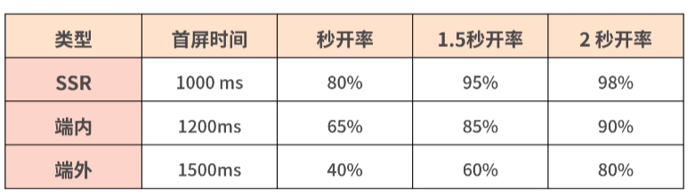
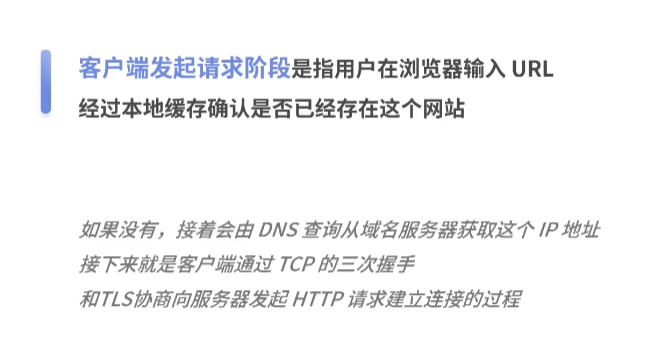
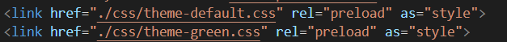

前端开发的理解
# 什么是前端
将数据以直观形式展示给用户，提升用户体验，存储数据通过表单数据保存到后台
前端开发是个承上启下的角色，结合用户需求，将数据存储在后台，将数据根据ui效果展示给用户使用
# echarts
数据可视化：借助图形去展示用户数据比文字更直观
# vue
双向绑定原理
vuex
router
# js
## 性能优化：
性能优化流程
指标设定
性能标准
收益评估
诊断清单
优化手段
性能立项
性能实践
### 体系总览
什么样的指标值得我们关注
关键结果，就是用户真正关心什么
真实体验，就是用户使用产品的感受
加载就是进入页面时，页面内容的载入过程
交互就是用户点击网站或app的某个功能页面给出的回应
视觉稳定性指标CLS（Cumulative Layout Shift）也就是布局偏移量，它是指页面从一帧切换到另外一帧时，视线中不稳定元素的偏移情况
FID指标（First Input Delay，首次输入延迟）指标必须尽量小于100ms
PSI（Perceptual Speed Index，视觉变化率）衡量标准是小于20%
CLS，除了依赖google的lighthouse做本地采集，目前还没有好的方案
白屏时间：指的是从输入内容回车（包括刷新、跳转等）后到页面开始出现第一个字符的时间，标准时间300ms
哪些因素会导致白屏时间过长
有可能是dns查询时间长，建立tcp请求，链接太慢，或者是服务器处理请求速度太慢，客户端下载、解析、渲染时长过长，没有做Gzip压缩，缺乏本地离线化处理，等等
首屏时间=白屏时间+渲染时间
从浏览器输入地址并回车后，到首屏内容渲染完毕的时间这期间不需要滚动鼠标或者下拉页面，否则无效
从重要性角度看，打开页面后，第一眼看到的内容一般都非常关键，比如电商的头图、商品价格、购买按钮等。这些内容即便在最恶劣的网络环境下，我们也要确保用户能看得到
从体验完整性角度看，进入页面后先是白屏，随着第一个字符加载，到首屏内容显示结束，我们才会认为加载完毕，用户可以使用了
首屏时间的标准，最初只是根据这个页面对时间是否敏感来判定。主要以用户平均首屏加载时间来计算，并没有区分2G\3G\4G\WIFI这些网络环境
白屏<1s,首屏<1.5s,onload<3s
首屏时间在1s内，用户感觉会很快
如果首屏时间超过2.5s，用户就会感觉很慢
在1s内打开页面，人们对这么短的时间并不敏感，体验不出10ms和50ms有什么差别
当到了2G\3G弱网环境，或者网络不稳定的环境
用户联网加载的时间会特别长，严重影响指标
前端工程师在使用过程中，越来越觉得用平均值来表示加载时间并不准确可靠
人们又开始用中位数，做正态分布，看分位值统计P50（50分位值）P90（90分位值）P99（99分位值）
以P99为例，我们是把所有首屏时间排序得出排在第99位的首屏时间就是P99
引入了秒开率的指标，即1s内打开用户的占比

端内推送：当APP在前台运行时的推送
端外推送：当app在后台运行足够长的时间后，app进程由于被清理或其它原因，app自己的长连接断开。这时的推送是端外推送
首屏时间毕竟粒度太粗了。如果首屏时间长，白屏时间短
首屏时间可以拆分为白屏时间、数据接口响应时间、图片加载资源等
白屏时间数据接口响应时间可以直接从后端服务中获取，不需要前端再重复计算
### 性能瓶颈
浏览器会向DNS服务器发起DNS查询，获取ip地址
在建立连接后，浏览器就可以发起HTTP请求
而服务器端接收到后，对请求进行相应
浏览器从响应结果中拿到数据，并进行解析和渲染
最后在用户面前就出现了一个网页

本地缓存可以让静态资源加载更快，当客户端发起一个请求时，静态资源可以直接从客户端中获取，不需要再向服务器请求
强缓存是指浏览器在加载资源时，根据请求头的expires和cache-control判断是否命中客户端缓存
协商缓存是指浏览器会先发送一个请求到服务器，通过last-modified和etag验证资源是否命中客户端缓存

服务端瓶颈点在于是否做了数据缓存处理、是否做了GZIP压缩以及是否有重定向
CDN的基本思路是通过在网络各处放置节点服务器构造一个只能虚拟网络将用户的请求导向离用户最近的服务节点上
每请求一次数据接口，需要从客户端到后端服务器再到更后端的数据存储层，一层一层返回数据，最后再给到客户端，耗时很长
#### 重定向：是指网站资源迁移到其他位置后，用户访问站点时，程序自动将用户请求从一个页面转移到另外一个页面的过程
服务端发挥的302重定向、meta标签实现的重定向、前端JavaScript通过window.location实现的重定向，会引发新的DNS查询，导致新的tcp三次握手和tls协商以及产生新的http请求，而这些都会导致请求过程中更多的时间，进而影响前端性能
不会：拆包、分包
背景：系统大，模块较多
代码里使用echarts、lodash
分析哪些js加载时间长
### 1依赖第三方库内容过大，通过外链的形式加载

### 2路由懒加载

# css
## 水平居中：text-align:center\flex\tablecenter\grid
margin：auto、绝对定位+transform
## 垂直居中：line-height:center
子元素marginauto，父元素flex，或者父元素相对定位，子元素绝对定位，transform、table布局：vertical-align：middle
## 盒模型
## bfc