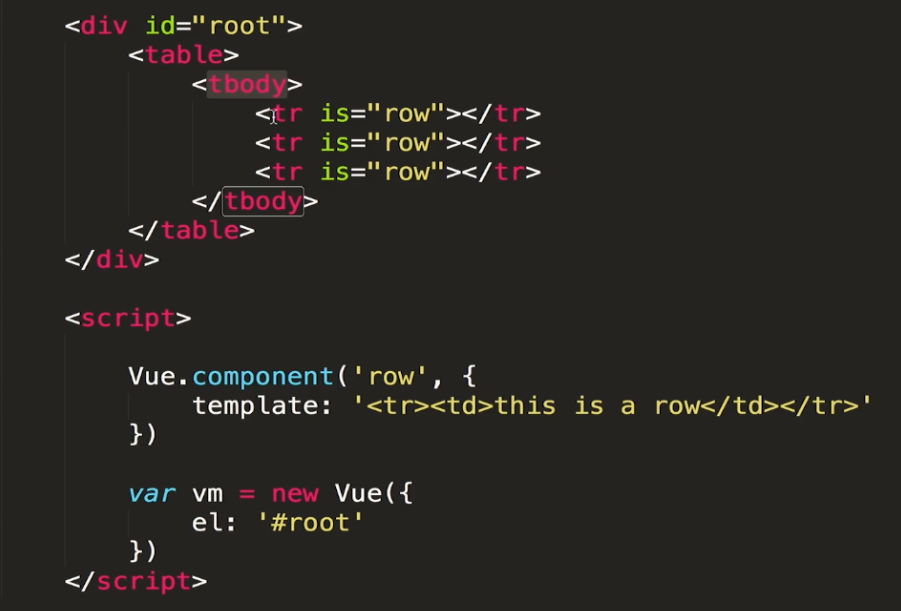
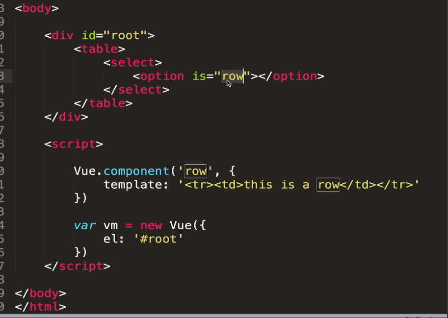
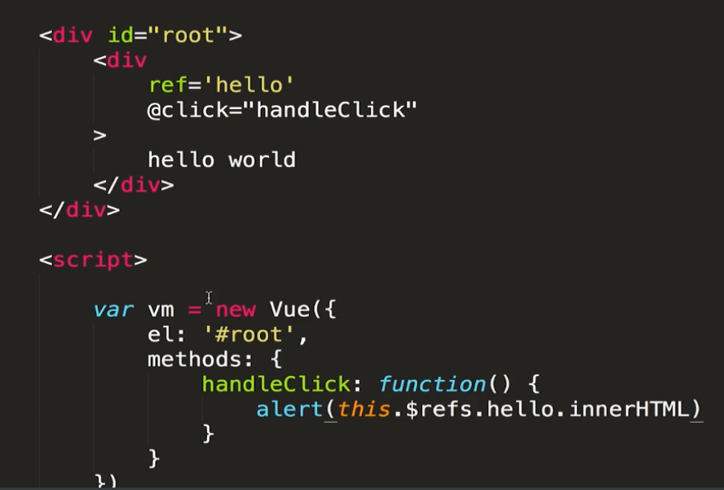

# VUE基础

## 1.v-if、v-show、v-html 的原理是什么，它是如何封装的?

v-if会调用addIfCondition方法，生成vnode的时候会忽略对应节点，render的时候就不会渲染；
v-show会生成vnode，render的时候也会渲染成真实节点，只是在render过程中会在节点的属性中修改show属性值，也就是常说的display；
v-html会先移除节点下的所有节点，调用html方法，通过addProp添加innerHTML属性，归根结底还是设置innerHTML为v-html的值

## 2.vue组件最佳实践

### 使用组件的细节点

vue 的 is属性解决模板标签bug

html5的tbody标签里只能写tr，怎么才能引用，使用is属性可以符合h5的编码规范

vue操作dom，ref获取dom节点进行引用，或者是获取组件的引用

